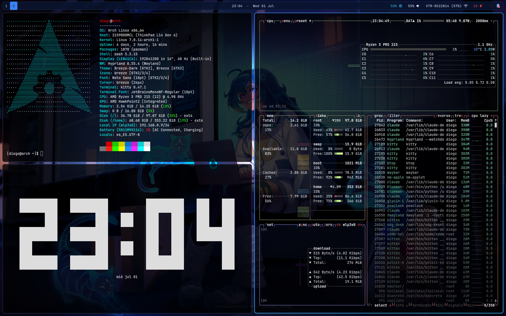

# dotfiles

Personal configuration files for Arch Linux with Hyprland. Managed with GNU Stow.



## Setup

- **OS:** Arch Linux
- **Compositor:** Hyprland (Wayland)
- **Login manager:** SDDM
- **Bar:** Waybar
- **Launcher:** wofi
- **Terminal:** kitty
- **Editor:** micro
- **System monitor:** btop
- **Audio visualizer:** cava
- **Fetch:** fastfetch
- **Media player:** mpv

## What's in this repo

```
dotfiles/
├── hypr/         # Hyprland compositor config
├── waybar/       # top bar
├── wofi/         # application launcher
├── kitty/        # terminal emulator
├── btop/         # system monitor
├── cava/         # audio visualizer
├── fastfetch/    # system fetch (runs on shell startup)
├── micro/        # terminal text editor
├── mpv/          # media player
├── docs/
│   └── screenshots/
├── LICENSE
├── .gitignore
└── README.md
```

Each top-level folder mirrors the structure relative to `$HOME` and is designed to be linked with GNU Stow.

## Requirements

Install the packages before applying the configs.

Official repositories:

```bash
sudo pacman -S hyprland waybar wofi kitty btop cava fastfetch micro mpv stow
```

Tested versions:

| Package    | Version   |
|------------|-----------|
| hyprland   | 0.55.4    |
| waybar     | 0.15.0    |
| wofi       | 1.5.3     |
| kitty      | 0.47.1    |
| btop       | 1.4.7     |
| cava       | 0.10.7    |
| fastfetch  | 2.65.2    |
| micro      | 2.0.15    |
| mpv        | 0.41.0    |

## Install

Clone the repo and use Stow to symlink every config into `$HOME`:

```bash
git clone https://github.com/dgcerpa/dotfiles.git ~/dotfiles
cd ~/dotfiles
stow hypr waybar wofi kitty btop cava fastfetch micro mpv
```

To apply a single component:

```bash
stow hypr
```

To remove the symlinks:

```bash
stow -D hypr waybar wofi kitty btop cava fastfetch micro mpv
```

Stow refuses to overwrite existing files. Back up or move any pre-existing config in `~/.config/` before running.

## Notes

- Hyprland version 0.55.4 (session runs without UWSM).
- The Hyprland config launches `gnome-keyring-daemon` at startup; install `gnome-keyring` if you rely on keyring-backed secrets.

## License

MIT — see [LICENSE](LICENSE).
